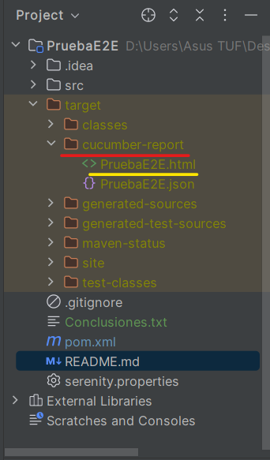

# Ejercicio de Automatización E2E con Serenity BDD Screeplay
Este es un proyecto de ejemplo donde se automatizan pruebas de una aplicación web utilizando el patrón **Screenplay** de Serenity.

## Funcionalidades
Este proyecto realiza pruebas funcionales automatizadas utilizando Serenity BDD screenplay, el cual, permite un flujo de compra en la página
https://www.saucedemo.com/ que incluya:

* Autenticarse con el usuario: standard_user y password: secret_sauce
* Agregar dos productos al carrito
* Visualizar el carrito
* Completar el formulario de compra
* Finalizar la compra hasta la confirmación: “THANK YOU FOR YOUR ORDER”
  
## Requisitos
* IntelliJ IDEA 2023.3.3
* JDK 17: Verificar Java en las variables de entorno.
* Maven 3.9.9 : Importante que tengan Maven en las variables de entorno.
* Serenity BDD Screenplay se instalará automáticamente al ejecutar el proyecto junto a otras dependencias necesarias, estas se encuentran en el pom.xml
* Navegador web de preferencia:
  * Google Chrome

## Plugins necesarios en el IDE
* Cucumber for Java
* Gherkin

## Instalación
* Clonar el repositorio en la máquina local: git clone https://github.com/YOUR-USERNAME/YOUR-REPOSITORY.
* Verificar dependencias en el pom.xml
* * Abrir el archivo 'RunnersMain' de la ruta "src/test/java/runners"
* Click sobre 'Run' en la clase 'RunnerMain'

  ## Reporte
* El reporte se encuentra generado en la ruta **target/cucumber-report/PruebaE2E.html**
* 

# CONCLUSIONES

A lo largo de la resolución de este ejercicio, he confirmado que Serenity BDD Screenplay es un framework altamente eficiente y flexible para la automatización de pruebas a nivel web. Entre sus principales ventajas se destacan su capacidad para gestionar múltiples casos de prueba en diversos escenarios, lo que facilita una cobertura amplia de condiciones en un solo conjunto de pruebas. Este enfoque modular y organizado no solo optimiza el proceso de automatización, sino que también mejora la mantenibilidad y escalabilidad de las pruebas a medida que el proyecto crece.

En resumen, Serenity BDD Screenplay ofrece una solución robusta y bien estructurada para la automatización de pruebas, permitiendo un alto grado de personalización y eficiencia en la ejecución de pruebas complejas.
